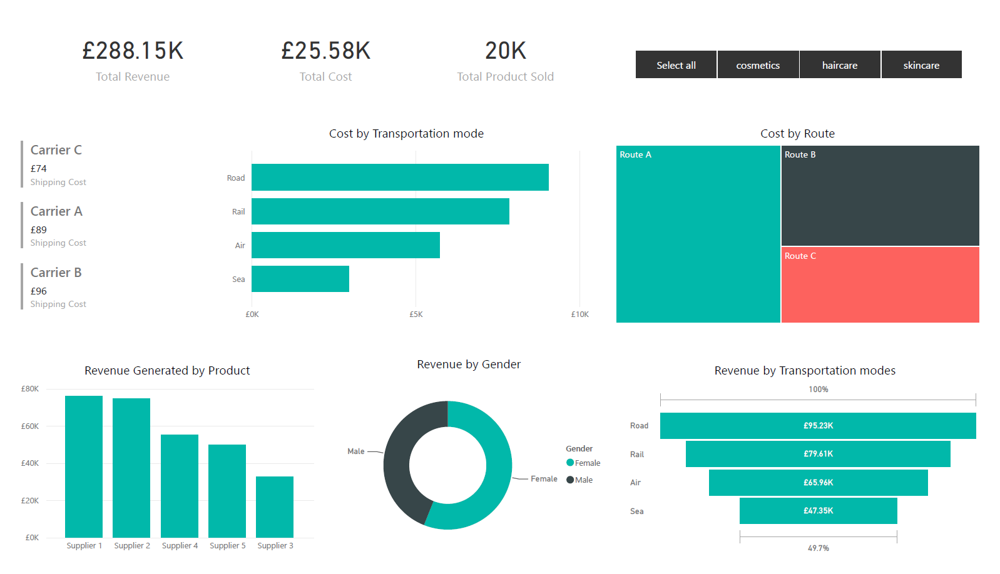

# 🚚 Supply Chain Analytics Dashboard (Power BI)

## 📌 Project Overview

The **Supply Chain Analytics Dashboard** is an interactive Power BI report designed to monitor key supply chain metrics, including revenue, transportation costs, shipping routes, product performance, and customer demographics.

The dashboard provides decision-makers with actionable insights into transportation efficiency, supplier performance, and revenue distribution, enabling better operational and strategic planning.

---

## 📷 Dashboard Preview



---

## 🎯 Business Objective

The goal of this dashboard is to help supply chain managers and business stakeholders:

* Monitor overall revenue and transportation costs
* Compare transportation modes and shipping expenses
* Evaluate supplier performance
* Analyse revenue by product category
* Understand customer demographics
* Identify the most profitable transportation routes

---

## 📊 Dataset

* **Source:** CSV file
* **Format:** Comma Separated Values (.csv)
* **Data Processing:** Power Query (Power BI)

The dataset contains transactional supply chain information including:

* Product Category
* Supplier
* Carrier
* Transportation Mode
* Route
* Revenue
* Cost
* Gender
* Quantity Sold

---

## 🛠️ Tools & Technologies

* Power BI Desktop
* Power Query
* DAX
* CSV Dataset

---

## 📈 Key Performance Indicators (KPIs)

| KPI           | Value        |
| ------------- | ------------ |
| Total Revenue | **£288.15K** |
| Total Cost    | **£25.58K**  |
| Products Sold | **20K**      |

---

## 📊 Dashboard Features

### Executive KPIs

Quick overview of the business performance through:

* Total Revenue
* Total Transportation Cost
* Total Products Sold

---

### Revenue by Product

Displays total revenue generated by each supplier, making it easy to identify top-performing suppliers.

**Business Value**

* Compare supplier performance
* Identify highest revenue contributors
* Support supplier evaluation

---

### Cost by Transportation Mode

Compares transportation costs across different delivery methods.

Transportation modes include:

* Road
* Rail
* Air
* Sea

**Business Value**

* Monitor logistics costs
* Identify cost-saving opportunities
* Optimise transportation strategy

---

### Revenue by Transportation Mode

Displays revenue generated through each transportation method.

This visual helps compare transportation costs against generated revenue to evaluate profitability.

---

### Cost by Route

Treemap visual comparing transportation costs across major shipping routes.

Routes include:

* Route A
* Route B
* Route C

Useful for identifying expensive shipping routes and improving logistics planning.

---

### Shipping Cost by Carrier

Displays shipping costs for major logistics carriers.

Current carriers include:

* Carrier A
* Carrier B
* Carrier C

Supports carrier comparison and procurement decisions.

---

### Revenue by Gender

Shows revenue distribution between:

* Female customers
* Male customers

Useful for customer segmentation and marketing analysis.

---

## 🎛️ Interactive Features

The dashboard includes an interactive product category filter allowing users to analyse:

* Cosmetics
* Haircare
* Skincare

All charts and KPIs update dynamically based on the selected category.

---

## 💡 Key Insights

* Road transportation generates the highest revenue but also incurs the highest transportation cost.
* Supplier 1 and Supplier 2 are the highest revenue-generating suppliers.
* Route A contributes the largest share of transportation costs.
* Female customers contribute a slightly higher share of revenue than male customers.
* The category slicer enables quick comparison of product performance across Cosmetics, Haircare, and Skincare.

---

## 📁 Repository Structure

```
Supply-Chain-Analytics/
│
├── README.md
├── supply-chain.pbix
│
├── data/
│   └── supply_chain_data.csv
│
├── screenshots/
    └── supply-chain.png

---

## 🚀 How to Use

1. Clone or download this repository.
2. Open the `.pbix` file using Power BI Desktop.
3. If prompted, reconnect the CSV dataset located in the `data` folder.
4. Refresh the report to load the latest data.

---

## 📚 Skills Demonstrated

* Data Cleaning using Power Query
* Data Transformation
* Data Modelling
* DAX Measures
* KPI Design
* Interactive Dashboard Development
* Supply Chain Analytics
* Business Intelligence Reporting
* Data Visualisation

---

## 📈 Future Improvements

Potential enhancements include:

* Delivery performance (On-Time Delivery %)
* Shipping delay analysis
* Inventory turnover dashboard
* Monthly and yearly trend analysis
* Forecasting using Power BI Analytics
* Geographic shipment mapping
* Profit margin analysis
* Drill-through pages for supplier and transportation details

---

## 👤 Author

**Nadeem Shafi**

**Skills**

* Power BI
* SQL
* Python
* Excel
* Data Analysis
* Business Intelligence
* Data Visualisation

---

## 📄 License

This project is intended for learning and portfolio purposes.
